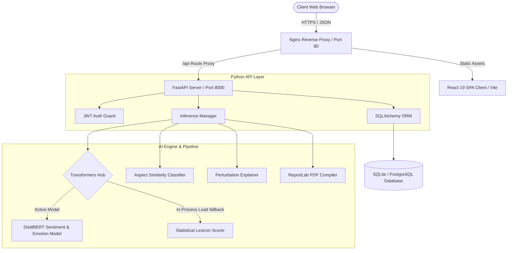
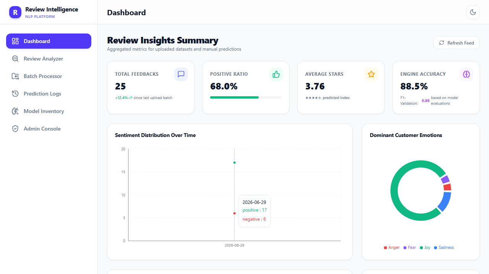
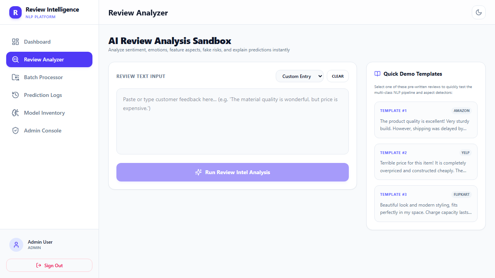
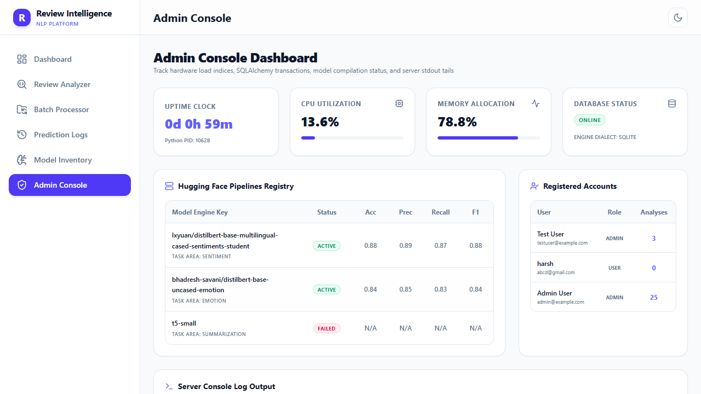
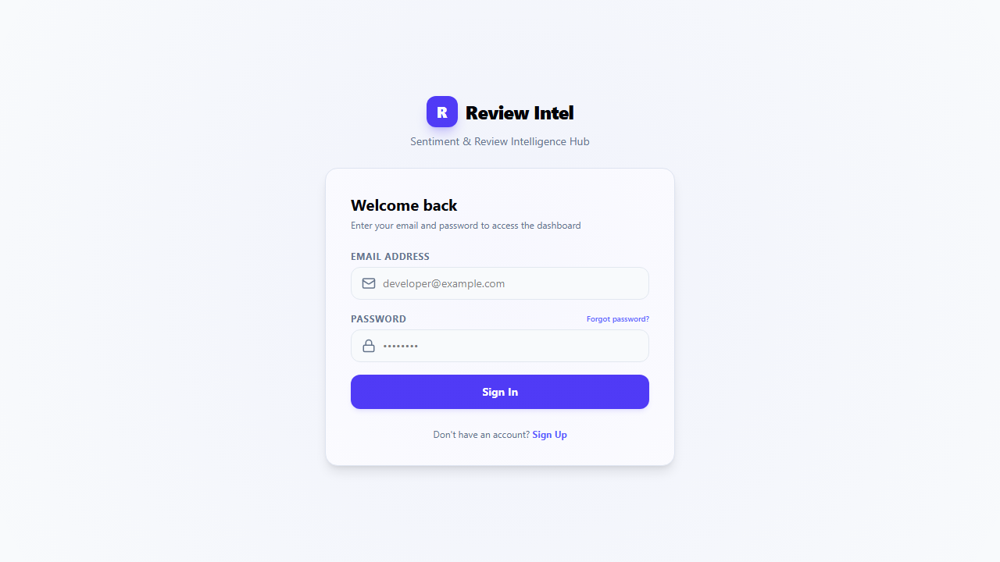

# Sentiment Analysis of Reviews

An enterprise-grade, production-ready AI feedback parsing dashboard leveraging Hugging Face Transformers and FastAPI to perform multi-class Sentiment Analysis, ABSA (Aspect-Based Sentiment Analysis), Emotion Detection, Spam/Bot Risk Assessments, and Executive Summarization.



---

## Features

1. **Dashboard & Visual Analytics:** Real-time chart widgets showing overall review tallies, average ratings, emotion distributions (Recharts Donut), sentiment trends (Recharts Area), and aspect satisfaction scores.
2. **Review Playground (Sandbox):** Test single text predictions with predictions details, star count projections, latency speeds, and aspect classifications.
3. **AI Explainability Heatmap:** Token-level attention highlighter displaying positive (green) and negative (red) contributions for predicted sentiment, complete with hover tooltips.
4. **Authenticity Guard:** Checks text lexical diversity, punctuation ratios, and sentiment-rating discrepancies to score spam and bot likelihood.
5. **Summarization & Insights:** Condenses text blocks into bulleted customer complaints, praises, and actionable suggestions.
6. **Aspect-Based Sentiment (ABSA):** Detects dimensions like Price, Performance, Packaging, or Customer Service and evaluates their sentiments.
7. **Advanced Batch Analytics Dashboard:** Drag-and-drop CSV or Excel databases to execute bulk predictions. Monitor execution via a multi-stage animated progress bar, and instantly visualize results through Recharts-powered interactive charts (Sentiment Pie, Emotion Tones, Trend Lines), a custom Keywords Cloud, auto-generated Executive Summaries, and a searchable paginated data table. Easily download compiled logs or executive PDF reports.
8. **Admin Health Console:** View CPU/RAM system health, database states, model details, registered users, and tail console log buffers.

## Screenshots

| Dashboard Analytics | AI Review Analysis |
|:---:|:---:|
|  |  |
| **System Admin Panel** | **Secure Login Portal** |
|  |  |

---

## Folder Structure

```text
review-intelligence-platform/
├── backend/
│   ├── api/
│   │   ├── router_admin.py     # System health, tail logs, users tables
│   │   ├── router_analyze.py   # Text evaluation, CSV batching, PDF/XLSX exports
│   │   ├── router_auth.py      # Registration, sign-in, user profiles
│   │   └── router_dashboard.py # SQL metric aggregations
│   ├── services/
│   │   ├── ai_model.py         # Hugging Face manager & fallback pipelines
│   │   └── pdf_report.py       # ReportLab PDF compiler
│   ├── auth.py                 # JWT token crypt utilities
│   ├── config.py               # Pydantic Settings
│   ├── database.py             # SQLAlchemy session bindings
│   ├── main.py                 # FastAPI core application entry
│   ├── models.py               # Database schemas
│   ├── schemas.py              # Pydantic validation rules
│   ├── requirements.txt        # Python pip dependencies
│   └── Dockerfile              # Backend container layout
├── frontend/
│   ├── src/
│   │   ├── components/
│   │   │   └── Layout.tsx      # Sidebar, top headers, drawer overlays
│   │   ├── context/
│   │   │   ├── AuthContext.tsx # Sign-in states & Axios headers synchronizer
│   │   │   └── ThemeContext.tsx# Light/Dark mode toggling
│   │   ├── pages/
│   │   │   ├── AdminPanel.tsx  # Logs, systems, model status tables
│   │   │   ├── BatchProcessing.tsx # File drag-and-drop & download reports
│   │   │   ├── Dashboard.tsx   # Aggregated analytics and charts
│   │   │   ├── History.tsx     # Filterable logs, deletions, detail inspectors
│   │   │   ├── LandingPage.tsx # Gradient hero cards, SaaS features showcases
│   │   │   ├── Login.tsx       # Auth forms
│   │   │   ├── ModelInfo.tsx   # Model parameters inventories
│   │   │   └── Register.tsx    # Registration forms
│   │   ├── index.css           # Tailwind v4 directives & global stylings
│   │   └── App.tsx             # Routes mapping and protective wrappers
│   ├── vite.config.ts          # Vite configs and proxy settings
│   ├── package.json            # React & NPM package configs
│   ├── nginx.conf              # Nginx server reverse-proxy configuration
│   └── Dockerfile              # Frontend container build script
├── docker-compose.yml          # Container configuration script
└── .env.example                # Sample environment variables
```

---

## Installation & Setup

### Prerequisites
* Python 3.9+
* Node.js 18+ and npm
* Git

### Local Backend Setup
1. Open a terminal inside `/backend`.
2. Create a virtual environment and activate it:
   ```bash
   python -m venv venv
   # On Windows:
   venv\Scripts\activate
   # On macOS/Linux:
   source venv/bin/activate
   ```
3. Install dependencies:
   ```bash
   pip install -r requirements.txt
   ```
4. Start the FastAPI development server:
   ```bash
   uvicorn main:app --reload
   ```
   *Note: On first start, the backend will spawn a background thread to retrieve NLP Hugging Face weights to cache. Predictions will fall back onto statistical algorithms during loading.*

### Local Frontend Setup
1. Open a terminal inside `/frontend`.
2. Install npm dependencies:
   ```bash
   npm install
   ```
3. Start the Vite React client:
   ```bash
   npm run dev
   ```
4. Access the portal at `http://localhost:5173`. Register an account (the first account registered gains Admin status).

---

## API Documentation

FastAPI automatically serves Swagger documentation. With the backend running, access interactive specs at:
* Swagger UI: `http://localhost:8000/docs`
* ReDoc: `http://localhost:8000/redoc`

### Core Route Specifications:
* `POST /api/auth/register` - Create user credentials
* `POST /api/auth/login` - Obtain JWT session token
* `GET /api/auth/profile` - Retrieve current user account
* `POST /api/reviews/analyze` - Single review parser (Sentiment, Emotion, Aspects, Highlights, Recommendations)
* `POST /api/reviews/upload` - CSV/Excel upload with auto column detection
* `GET /api/reviews/history` - Searchable logs listing
* `GET /api/reviews/export/csv` - History export to Comma CSV
* `GET /api/reviews/export/xlsx` - History export to Excel XLSX
* `GET /api/reviews/export/pdf` - Retrieve dynamic executive PDF review analysis report
* `GET /api/dashboard/metrics` - Aggregated dashboard metric sets
* `GET /api/admin/health` - System resources CPU/RAM diagnostics (Admin required)
* `GET /api/admin/model-status` - Loaded HF weight configurations
* `GET /api/admin/users` - Registered portal users listings (Admin required)
* `GET /api/admin/logs` - Server stdout logs tail (Admin required)

---

## Docker Deployment (Production)

To deploy the entire system in a production container structure with Nginx reverse proxying:
1. Open the repository root directory.
2. Build and launch all services:
   ```bash
   docker-compose up --build -d
   ```
3. The frontend is accessible on standard HTTP Port `80`, proxying `/api` queries internally to the backend server.


## Contributing
1. Fork this repository.
2. Build your feature branches (`git checkout -b feature/amazing-feature`).
3. Commit adjustments (`git commit -m 'Add amazing feature'`).
4. Push updates (`git push origin feature/amazing-feature`).
5. Open a Pull Request.
